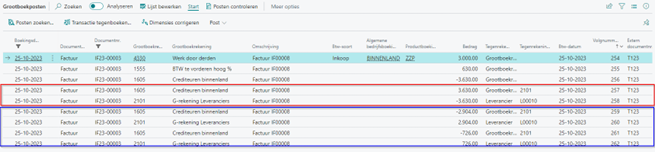

# Handleiding G-rekening

## Financiële verwerking inkoopfactuur i.c.m. G-rekening

Het verwerken van een inkoopfactuur van een leverancier met een G-rekening wordt op standaard manier aangemaakt en verwerkt. Echter bij het boeken van de inkoopfactuur wordt gecontroleerd of de betreffende leverancier de G-rekening instellingen heeft ingesteld. En als deze zijn ingesteld wordt de inkoopfactuur teruggeboekt en wordt de leveranciersposten gesplitst tussen de standaard- en G-rekening op basis van het G-rekening %.

### G-rekening percentage op inkoopfactuur

Bij het aanmaken van de inkoopfactuur wordt het percentage van de G-rekening van de leverancier opgehaald.
De gebruiker heeft de mogelijkheid om dit percentage nog aan te passen.

Als van 30% nu 20% wordt gemaakt, wordt de berekening direct aangepast:

### Boekingen inkoopfactuur G-rekening

Hierbij een voorbeeld van de boekingen die worden aangemaakt bij een inkoopfactuur met een leverancier met G-rekening:

Als we kiezen voor “Voorbeeld van de boeking weergeven” wordt de correctie en het splitsen van de leveranciersposten getoond.

Geboekte inkoopfactuur:

Op de geboekte inkoopfactuur is ook de split tussen ‘gewone’ – en G-rekening zichtbaar. Via menu Navigeren > G-rekening. Deze pagina toon o.a. de transactiewijze code en het bedrag van de factuur wat op de G-rekening moet wordt betaald, volgens de instelling op de leverancierskaart.

Navigeren naar gerelateerde boekingen via Start -> Posten zoeken :

### Aanmaken leveranciersposten G-rekening

Om ervoor te zorgen dat de betaling van de inkoopfactuur op twee rekeningen wordt geboekt, de G-rekening en een deel op de standaard leveranciers bankrekening, moeten de leveranciersposten van de originele inkoopfactuur worden teruggeboekt en worden gesplist in twee delen. Deze terugboeking wordt in de achtergrond uitgevoerd via een financieel dagboek.
Tijdens deze correctie/ terugboeken wordt de correctie met de originele inkoopfactuur factuur vereffend en blijven alleen de twee gesplitste leveranciersposten over, waarbij totaal gelijk blijft aan het originele factuurbedrag (bedrag incl. btw).

Financiële dagboek velden correctie leveranciersposten originele inkoopfactuur:
1.	Documentnr. = Inkoopfactuurnummer originele factuur
2.	Extern documentnr. = factuurnummer originele inkoopfactuur
3.	Vervaldatum = vervaldatum originele inkoopfactuur
4.	Bedrag = inkoopfactuurbedrag x -1
5.	Code transactiewijze = gelijk aan originele inkoopfactuur
6.	Vereffeningssoort = factuur
7.	Vereffenings-id = geboekte inkoopfactuurnummer

Correctieboeking > splitsen van leveranciersposten.

| **Leverancier**  | **Documentnr.** | **Bedrag** | **Tegen- rekening** | **Code Transactie wijze** | **Bankrekening** | **Vereffenings-id** |
| ------------- | ------------- | ----------- | ----------- | ----------- | ----------- | ----------- |
| L00010 | IF23-00003 | 3.630,00 | 2101 | SEPA | STANDAARD | IF23-00003 |
| L00010 | IF23-00003 | -2904,00 | 2101 | SEPA | STANDAARD | |
| L00010 | IF23-00003 | -726,00 | 2101 | SEPA | G-REK | |

Hier zie je de terugboeking van de originele inkoopfactuur en de nieuwe posten verdeeld per bankrekening.

**Gedetailleerde leveranciersposten:**

In de gedetailleerde leveranciersposten zie je ook de vereffening van de originele factuur.

###	Aanmaken grootboekposten G-rekening
Onder de grootboekposten zie je alle gerelateerde boekingen in het grootboek. Hier zie onder andere het gebruik van de tussenrekening voor G-rek. inkoop > 2201 die gebruikt wordt bij de correctieboekingen.

| **GB-rekening** | **GB-omschrijving** | **Bedrag** |
| --------------- | ------------------- | ---------- |
| 4330 | Werk door derder | 3000,00 |
| 1555 | BTW te vorderen hoog % | 630,00 |
| 1605 | Crediteuren binnenland | -2.904,00 |
| 1601 | Crediteuren | -726,00 |

| **GB-rekening** | **GB-omschrijving** | **Bedrag** |
| --------------- | ------------------- | ---------- |
| 2101 | G-rekening leveranciers | -3.630,00 |
| 2101 | G-rekening leveranciers | 2.904.00 |
| 2101 | G-rekening leveranciers | 726.00 |

[:arrow_left:](../README.md) [Back](../README.md)