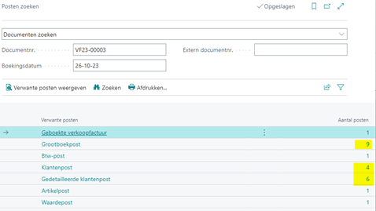

# Handleiding G-rekening

## Financiële verwerking verkoopfactuur i.c.m. G-rekening

Ook de verkoopfactuur van een klant met een G-rekening wordt op de standaard manier aangemaakt en verwerkt. Ook hier kan het percentage dat naar de G-rekening van de klant moet nog worden aangepast.
Bij het boeken van de verkoopfactuur wordt gecontroleerd of bij de betreffende klant de G-rekening instellingen zijn ingesteld. Indien deze zijn ingesteld wordt de verkoopfactuur teruggeboekt en wordt de klantenpost gesplitst tussen de standaard- en G-rekening op basis van het G-rekening % dat op de factuur is vastgelegd.

### Boekingen verkoopfactuur G-rekening

Hierbij een voorbeeld van de boekingen die worden aangemaakt bij een verkoopfactuur met een G-rekening:

Geboekte verkoopfactuur:

Op de geboekte verkoopfactuur is de split tussen ‘gewone’ – en G-rekening zichtbaar. Via menu Gerelateerd > Factureren > G-rekening.

Via posten zoeken naar gerelateerde boekingen:

## Aanmaken klantposten G-rekening
De creatie van de nieuwe klantposten met de splitsing naar de G-rekening vindt op dezelfde manier plaats als bij de leveranciersposten zoals eerder beschreven.

Klantposten:
Hier zie je de terugboeking van de originele verkoopfactuur en de nieuwe posten verdeeld  a.d.h.v. de G-rekening instellingen

### Gedetailleerde klantposten

In de gedetailleerde klantposten zie je ook de vereffening van de originele factuur.

### Aanmaken grootboekposten G-rekening

Onder de grootboekposten zie je alle gerelateerde boekingen in het grootboek. Hier zie je onder andere het gebruik van de tussenrekening voor G-rek. verkoop > 2102 die gebruikt wordt bij de correctieboekingen.

| **GB-rekening** | **GB-omschrijving** | **Bedrag** |
| --------------- | ------------------- | ---------- |
| 8210 | Omzet diensten binnenland | -4.000,00 |
| 1510 | BTW af te dragen hoog % | -840,00 |
| 1305 | Debiteuren binnenland | 3.388,00 |
| 1305 | Debiteuren binnenland | 1.452,00 |

| **GB-rekening** | **GB-omschrijving** | **Bedrag** |
| --------------- | ------------------- | ---------- |
| 2102 | G-rekening klanten | 4.840,00 |
| 2102 | G-rekening klanten | -3.388,00 |
| 2102 | G-rekening klanten | -1.452,00 |

[:arrow_left:](../README.md) [Back](../README.md)