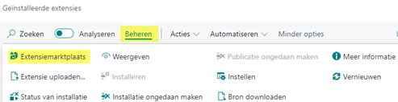

# Handleiding G-rekening

## Installer en activeer de app

1. Kies het Zoek pictogram, voer Extensiebeheer in en kies de gerelateerde koppeling.

2. Kies vanuit het menu Beheren gevolgd door Extensiemarktplaats.

3. In de AppSource Apps for Business Central zoek je naar G-Accounts.

4. Selecteer de App.

5. Selecteer Get It Now.

6. Kies via het menu voor Beheer gevolgd door Status van de installatie. 

7. Controleer of de status op Compleet staat.

[:arrow_left:](../README.md) [Back](../README.md)