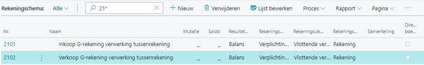
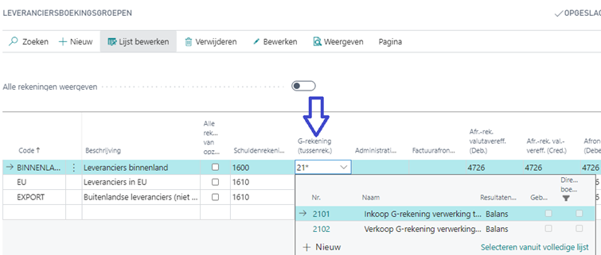
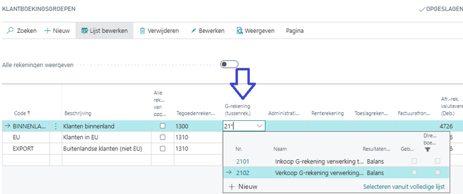

# Handleiding G-rekening

## Instellingen leveranciers- klanten boekingsgroepen

### Grootboekrekeningen (tussenrekening)

Voor de verwerking van de correctie en de splitsing van de factuur in een “regulier” en een “G-rekening” deel via een financieel dagboek is/zijn er GB-tussenrekeningen nodig. Het advies is om hiervoor twee tussenrekeningen te gebruiken zodat de inkoop en verkoop gesplitst is. Deze rekeningen moet altijd een saldo van 0 hebben na elke verwerking.

> [!IMPORTANT]
Let op dat Direct boeken uit staat voor deze rekeningen, deze rekening mag alleen vanuit het automatisch verwerking via de G-Account extensie worden gebruikt omdat dit een tussenrekening betreft voor deze functionaliteit. Het gebruiken van deze rekening voor andere boekingen bemoeilijkt controles in de toekomst.

Voorbeeld:

### Leveranciersboekingsgroepen instellingen

1.	Kies het Zoek pictogram, voer Leveranciersboekingsgroepen in en kies de gerelateerde koppeling.
2.	Selecteer in het veld G-rekening (tussenrek.) de gerelateerde code voor inkoop.

### Klantenboekingsgroepen instellingen

1.	Kies het Zoek pictogram, voer Klantboekingsgroepen in en kies de gerelateerde koppeling.
2.	Selecteer in het veld G-rekening (tussenrek.) de gerelateerde code voor verkoop.

[:arrow_left:](../README.md) [Back](../README.md)