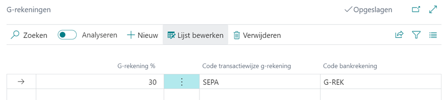

# Handleiding G-rekening

## Instellingen G-rekening leverancierskaart

### Bankrekeningen leverancier
Als een leverancier aangeeft dat er een deel op een G-rekening moet worden verwerkt moet deze rekening worden toegevoegd aan de Bankrekeningen Leverancier op de leverancierskaart.

Deze bankrekening kan je vanuit de leverancierskaart toevoegen via het menu Navigeren > Leverancier > Bankrekening. Of via het veld Bankrekeningcode van voorkeur onder het snel tabblad Betalingen op de leverancierskaart via onderstaande stappen.

1.	Selecteer in het veld Bankrekeningcode van voorkeur de actie Selecteren vanuit volledige lijst.
2.	Selecteer in het menu de actie +Nieuw.
3.	Vul in het veld Code een gerelateerde code.
4.	Vul in het veld Naam een omschrijving van de rekening.
5.	Selecteer onder snel tabblad Transfer in het veld Swift-code de relateerde code.
6.	Vul onder snel tabblad Transfer in het veld IBAN de relateerde G-bankrekening.
7.	Vul onder snel tabblad Rekeninghouder de gerelateerde info in.

### G-rekening instellingen leverancierskaart

Via de leverancierskaart geef je het deel van de inkoopfactuurwaarde op dat naar de G-rekening van de leverancier moet worden overgemaakt. 
Selecteer in het menu Gerelateerd > Leverancier > G-rekening en vul de gerelateerde velden in.

1.	Vul in het veld G-rekening % het gerelateerde percentage.
2.	Selecteer in het veld Code transactiewijze G-rekening de relateerde code.
3.	Selecteer in het veld Code bankrekening de gerelateerde code.

Voorbeeld:

[:arrow_left:](../README.md) [Back](../README.md)