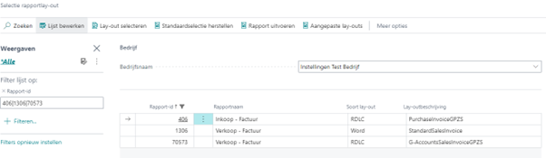
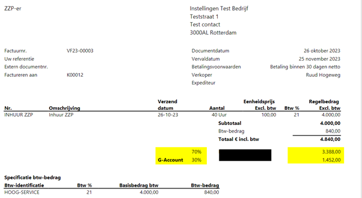

# Handleiding G-rekening

## Selectie rapportlay-out instellingen

Voor de inrichting van de Lay-out met de G-rekening wordt gebruik gemaakt van de standaard rapporten voor inkoopfactuur (406) en verkoopfactuur (1306 en 70573). Echter moet er bij deze rapporten wel een specifieke rapportlay-out gekozen worden. Deze wordt automatisch meegeleverd bij de extensie.

Build in lay-out.

406 – Inkoopfactuur > ./src/PurchaseInvoice.rdlc

1306 – verkoopfactuur > ./src/StandardSalesInvoice.docx

70573 – Verkoopfactuur (Bluace) > Verkoopfactuur (G-rekening)

Voorbeeld verkoopfactuur (70573)

[:arrow_left:](../README.md) [Back](../README.md)